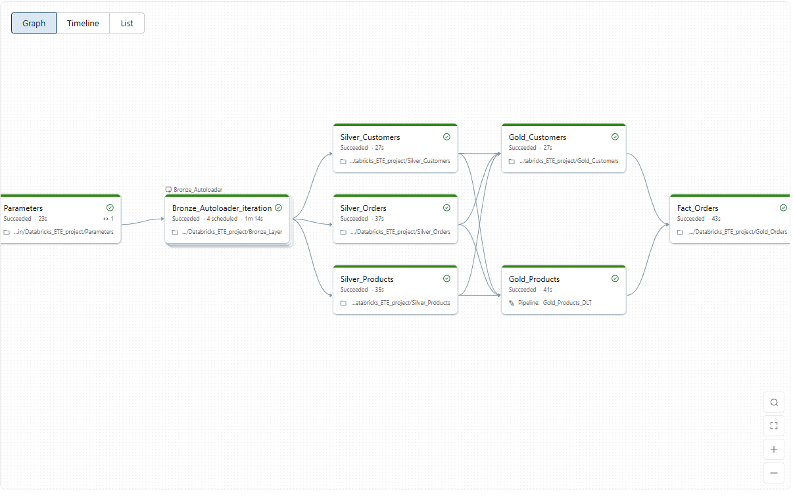
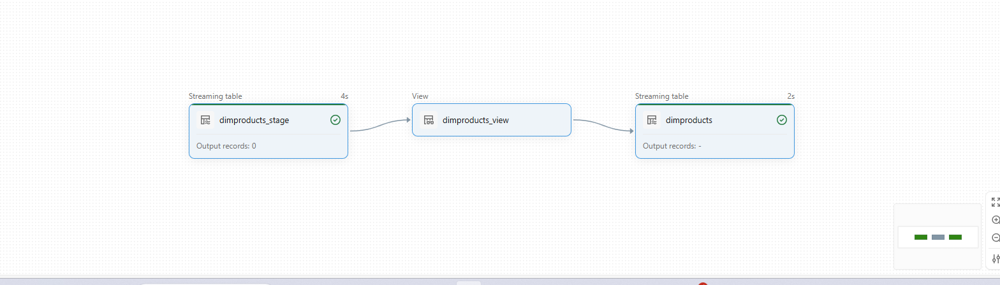

# Retail_DE_Project

Retail Data Engineering Project using Azure Databricks, PySpark, Delta Lake, and Medallion Architecture (Bronze, Silver, Gold) for customer, product, order, and regional sales analytics.

## Project Overview

The pipeline processes retail data related to customers, products, orders, and regions. Raw data is ingested into the Bronze layer, transformed and cleansed in the Silver layer, and loaded into Gold tables for analytical reporting.

## Key Features

- Bronze, Silver, and Gold layer implementation
- Data cleansing and transformation using PySpark
- Parameter-driven data processing
- Delta Lake storage format
- Slowly Changing Dimension (SCD Type 2) implementation in Gold tables

## Architecture

Bronze Layer → Silver Layer → Gold Layer

## End-to-End Pipeline

This pipeline orchestrates the complete flow of retail data through the Bronze, Silver, and Gold layers. Data is ingested, transformed, validated, and enriched to create analytics-ready datasets for reporting and business intelligence.

## Gold Layer SCD Type 2 Pipeline

This pipeline processes product dimension data through staging and transformation layers before loading it into the Gold dimension table. SCD Type 2 logic is implemented to preserve historical changes, enabling point-in-time reporting, historical analysis, auditing, and complete data lineage.

## SCD Implementation

Gold tables implement Slowly Changing Dimensions (SCD Type 2) to maintain historical changes in dimensional data. This enables:

- Historical tracking of customer and product changes
- Point-in-time reporting
- Data warehouse best practices
- Improved business analytics and auditing
- Preservation of complete attribute history

## Technologies Used

- Azure Databricks
- PySpark
- SQL
- Delta Lake
- Azure Data Lake Storage (ADLS)
- Medallion Architecture

## Data Domains

- Customers
- Products
- Orders
- Regions
